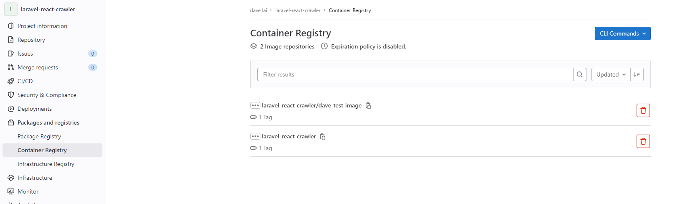
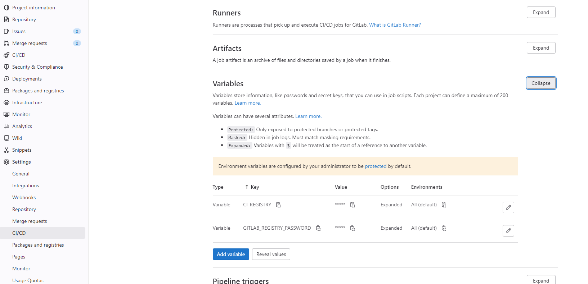
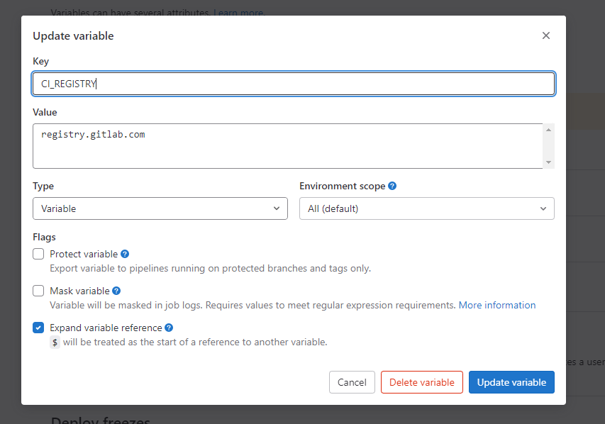

## Docker in docker

Run docker image for gitlab runner, build project image and push to gitlab in the gitlab runner docker.

In this way, in we change our docker file, we can automatically build and test it.


### `.gitlab-ci.yml` file

```yaml

image: docker

services:
  - docker:dind

variables:
  CI_IMAGE: $CI_REGISTRY_IMAGE/dave-test-image:latest
  GITLAB_REGISTRY_USERNAME: gitlab+deploy-token-1611692

build:
  stage: build
  only:
    variables:
      - $CI_COMMIT_MESSAGE =~ /build-image/
      - $CI_COMMIT_TAG =~ /build-image/
  before_script:
      - docker login $CI_REGISTRY -u $GITLAB_REGISTRY_USERNAME -p $GITLAB_REGISTRY_PASSWORD
  script:
    - docker build -t $CI_IMAGE .
    - docker push $CI_IMAGE

```


### Image build and upload




### Gitlab variable setting




**Need to uncheck `Protect varialbe` if testing ci/cd from unprotected branch**

