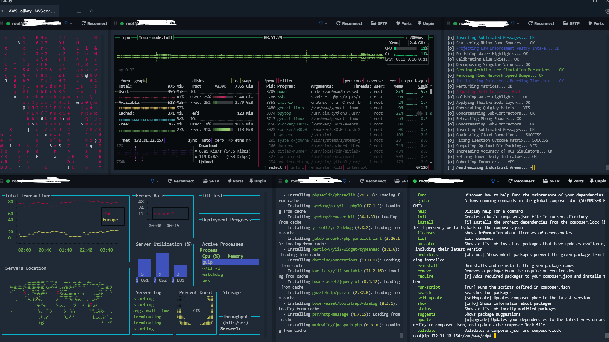

<!--HugoNoteFlag-->

---

## Useful 

* cmatrix
* bpytop
* genact-linux
  * `./genact-linux -m julia -m weblog -m simcity -m mkinitcpio --speed-factor 8`
  * `./genact-linux -m weblog -m simcity -m composer --speed-factor 5`

## Cool but somehow may Cost lots of CPU

* hollywood
* blessed-contrib

## Example

---

<!--HugoNoteZhFlag-->

# Translated by ChatGTP

## 有用的

* cmatrix
* bpytop
* genact-linux
  * `./genact-linux -m julia -m weblog -m simcity -m mkinitcpio --speed-factor 8`
  * `./genact-linux -m weblog -m simcity -m composer --speed-factor 5`

## 酷但可能會消耗很多 CPU

* hollywood
* blessed-contrib

## 範例

