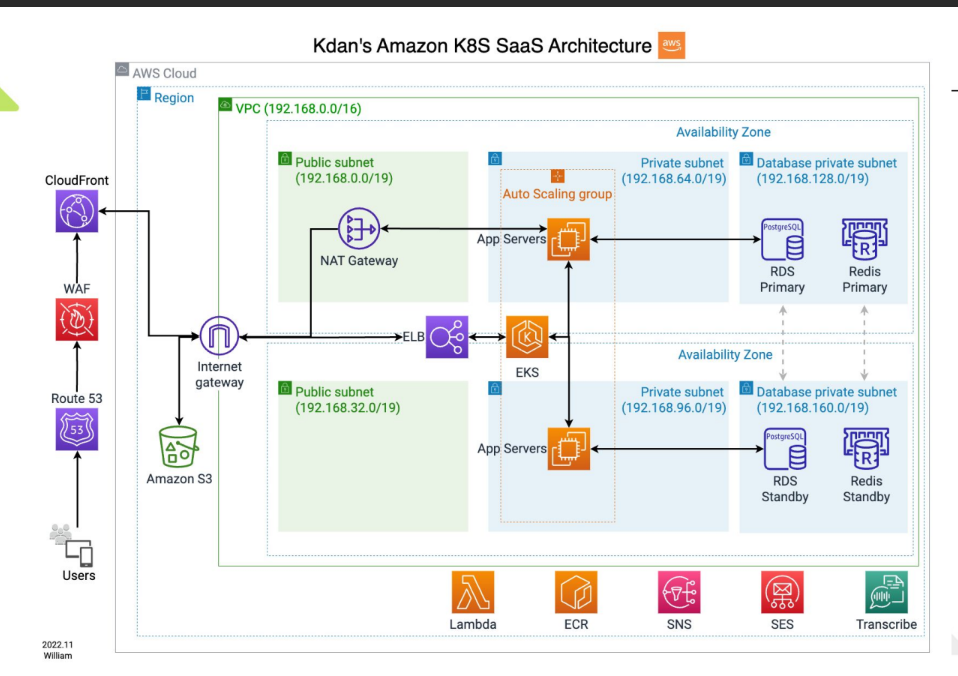

## Experience with Kubernetes Adoption

### Why

* Cannot easily recover system from failure
* Bad CPU utilize
* EC2 security update management
* Fast create new environment

### Plan

* 1 year to test environment, 1.5 year to production
* Conduct regular workshop

### Problem

* Switching to ARM architecture
* AWS CloudFront limit, if GET API using JSON body, will get 403
* AWS recommend WAF, but will causing service fail in China
  * Give up on this one, don't use it
* Total pod's limit memory shouldn't exceed node's memory

### ISO 27001

* Using IaC (Infrastructure as Code), make rebuild environment easier
  * example: Terraform, create an EC2 instance through code, instead of manually through AWS console

### After Kubernetes

* WAF -> CDN -> ELB -> EKS -> ingress-nginx
* KMS ConfigMap instead of Secret in project env file
* CloudTrail
* IaC recover

### Conclusion

* High Availability (HA) is built with lots of money
